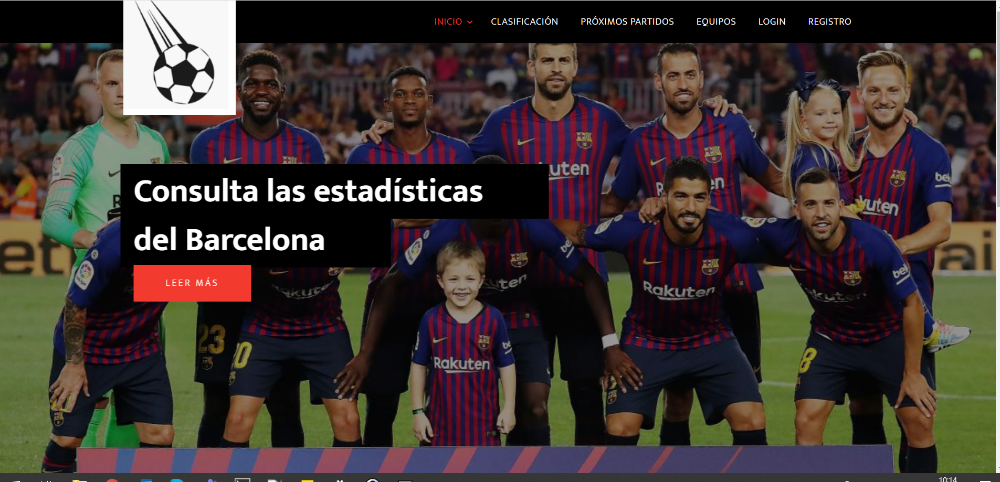

# webapp15

# Name of application: 
'Mis resultados'
# Members of the dev team:
|        **Member**        |          **URJC email**          |        **GitHub**       |
|:---|:---|:---|
| *Álvaro Orbaneja Gómez* | a.orbaneja@alumnos.urjc.es   | [aorbaneja](https://github.com/aorbaneja) |
| *Juan Enrique Antón Marazuela*       | je.anton@alumnos.urjc.es    | [juanAntonMarazuela](https://github.com/juanAntonMarazuela) |

# Entitys:
Users and Teams.

The user entity have a field with the favorite team
# Permissions of the users:
Anonymous user: watch statics of the teams, tables and near matches.

Register user: bet on matches and visualize static of her favourite team.

Admin user: Entity team have a field of near matches (near matches 1,2 and 3). Admin user will be responsible for filling these fields when the matches are simulated for bets.

# Images:
## Página de inicio

# Graphics: 
The leaderboard.
# Complementary technology:
Google Maps for locate stadiums of the teams.
# Advanced algorithm:
Calculate the match bet based on team statistics 

 

