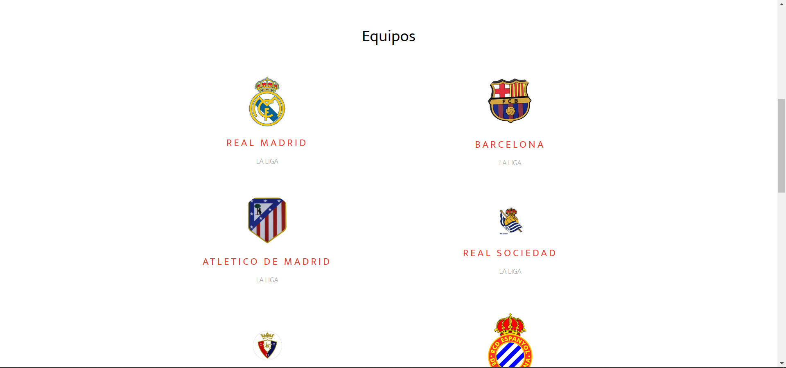
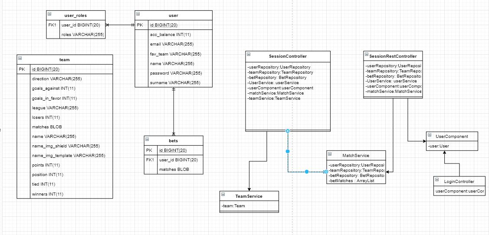

# webapp15

# Name of application: 
'Mis resultados'
# Members of the dev team:
|        **Member**        |          **URJC email**          |        **GitHub**       |
|:---|:---|:---|
| *Álvaro Orbaneja Gómez* | a.orbaneja@alumnos.urjc.es   | [aorbaneja](https://github.com/aorbaneja) |
| *Juan Enrique Antón Marazuela*       | je.anton@alumnos.urjc.es    | [juanAntonMarazuela](https://github.com/juanAntonMarazuela) |

# Entitys:
Users and Teams.

The user entity have a field with the favourite team
# Permissions of the users:
Anonymous user: watch statics of the teams, tables and near matches.

Register user: bet on matches and visualize static of her favourite team.

Admin user: Entity team have a field of near matches (near matches 1,2 and 3). Admin user will be responsible for filling these fields when the matches are simulated for bets.

# Images:
## Página de inicio

## Login

## Registro

## Apuestas

## Clasificación

## Próximos partidos

## Equipos

## Equipo

## Perfil de usuario

# Graphics: 
The leaderboard.
# Complementary technology:
Google Maps for locate stadiums of the teams.
# Advanced algorithm:
Calculate the match bet based on team statistics 

# Development and execution instructions:
In order to run succesfully the app, you will have to follow the next steps:

1. Download the app from repository https://github.com/CodeURJC-DAW-2019-20/webapp15
2. Run a MySQL 8.0.19 server with **user** root and **password** admin (you can change the password on the application.properties if your server password is not admin)
3. Open cmd and use the following up commands in order to create the database for the app:
	1. cd C:\Program Files\MySQL\MySQL Workbench 8.0 CE (or your path of MySql Workbench 8.0
	2. mysql -u root -p
	3. CREATE DATABASE mis_resultados_db;
	4. *OPTIONAL* SHOW DATABASES; (To check if the database was created)
4. Run the app **Mis resultados**

# ERD Diagram

 # Classes and templates
 
 
 # Dockers
 ## Development and execution instructions:
 1. Download the app from repository https://github.com/CodeURJC-DAW-2019-20/webapp15
 2. Change directory to $YOURWORKPLACE/webapp15/dockers
 3. Make sure you have maven installed in your system. If not, install it with yum install maven
 4. Install docker with yum install dockers
 5. Then, install docker-compose with sudo curl -L "https://github.com/docker/compose/releases/download/1.25.4/docker-compose-$(uname -s)-$(uname -m)" -o /usr/local/bin/docker-compose
 6. Run the script $YOURWORKPLACE/webapp15/dockers/create_images.sh
 7. In order to execute the app, change directory to $YOURWORKPLACE/webapp15/dockers/. Then, run the following command: docker-compose up
 
 
 
 # Participation
 
 ## Álvaro
 
 - Implementation: WebSecurity, BBDD (deploy, config and model), User (Controllers, Services, Entity), styles for htmls, embed Google Maps and implementation of its functionality, implementation of admin functionality (add matches),
 implementation of CRUD operation for user role (set favourite team), pagination with AJAX.
 
 - Top 5 commits: 
	- User+Security
	- Controllers+HTTPS+Databaseloader
	- Added Google Maps+Fav Teams (with errors)+fix bug Registro
	- Changed H2 to MYSQL
	- Teams Pageable with AJAX
	
- Top 5 files
	- Session Controller.java
	- UserRepository.java
	- User.java
	- WebSecurityConfig.java
	- UserRepositoryAuthenticationProvider.java

  ##Juan 	
 -Implementation: Team(Controllers,Entity,Repository), Match, Bet(Repository,Entity). Templates : Apostar.html,clasificacion.html,equipo.html,equipos.html, user.html and partidos.html. Logic of application, simulating matches and bets, generateRandomDate and generateRandomResult. Advanced algorithm. DoBet, CalculateBetCombined, Deletebet.. Add jar generation. 
 

 -Top 5 commits: 
 	-Templating images
	-Fix error in funcionality admin and user
	-Team Model and init repository 
	-More funcionality bets
	-Adding more funcionality bets and querys in Repository
 	
 -Top 5 files: 
 	-Sesion Controller.java
	- Apostar.html
	- Equipo.html
	- Match.java
	- user.html

##Fase 3. 
###Update diagram of class
# ERD Diagram

 #Participation Fase 3.

 ##Juan:
 
-Implementation: All SessionRestController except pageable rest. MatchService and model SessionController for consume this service. UserComponent session for api rest login(LoginController). New querys in TeamRepository. 

-Top 5 commits:
	-Firts Commit Api Res
	-Add more Put methods in RestController
	-New Service and new Rest api
	-Add funcionality rest bets
	-User Rest
	
	
-Top 5 files:
	- SessionRestController
	- SessionController
	- MatchService
	- UserComponent
	- LoginController
	
