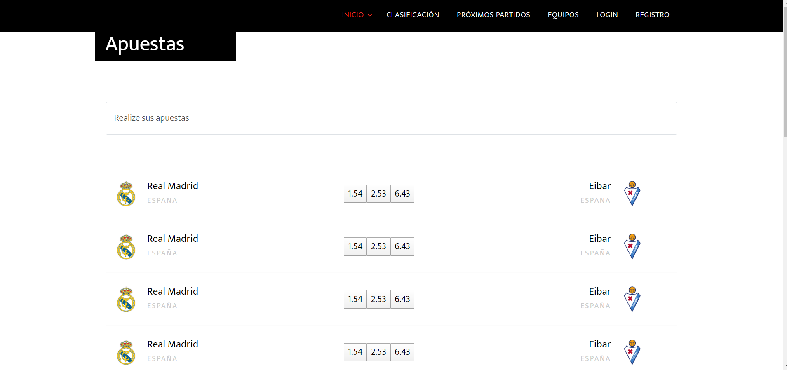

# webapp15

# Name of application: 
'Mis resultados'
# Members of the dev team:
|        **Member**        |          **URJC email**          |        **GitHub**       |
|:---|:---|:---|
| *Álvaro Orbaneja Gómez* | a.orbaneja@alumnos.urjc.es   | [aorbaneja](https://github.com/aorbaneja) |
| *Juan Enrique Antón Marazuela*       | je.anton@alumnos.urjc.es    | [juanAntonMarazuela](https://github.com/juanAntonMarazuela) |

# Entitys:
Users and Teams.

The user entity have a field with the favorite team
# Permissions of the users:
Anonymous user: watch statics of the teams, tables and near matches.

Register user: bet on matches and visualize static of her favourite team.

Admin user: Entity team have a field of near matches (near matches 1,2 and 3). Admin user will be responsible for filling these fields when the matches are simulated for bets.

# Images:
## Página de inicio

## Login

## Registro

## Apuestas

## Clasificación

## Próximos partidos

## Equipos

## Equipo

## Perfil de usuario
![Perfil de usuario] (screenshots/user.PNG)

# Graphics: 
The leaderboard.
# Complementary technology:
Google Maps for locate stadiums of the teams.
# Advanced algorithm:
Calculate the match bet based on team statistics 

# Development and execution instructions:
In order to run succesfully the app, you will have to follow the next steps:

1. Download the app from repository https://github.com/CodeURJC-DAW-2019-20/webapp15
2. Run a MySQL 8.0.19 server with **user** root and **password** admin (you can change the password on the application.properties if your server password is not admin)
3. Open cmd and use the following up commands in order to create the database for the app:
	1. cd C:\Program Files\MySQL\MySQL Workbench 8.0 CE (or your path of MySql Workbench 8.0
	2. mysql -u root -p
	3. CREATE DATABASE mis_resultados_db;
	4. *OPTIONAL* SHOW DATABASES; (To check if the database was created)
4. Run the app **Mis resultados**

 

